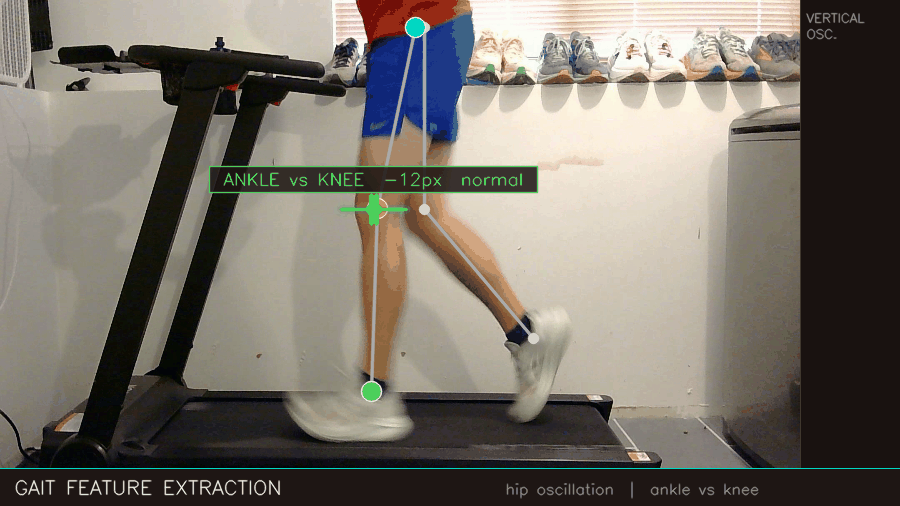
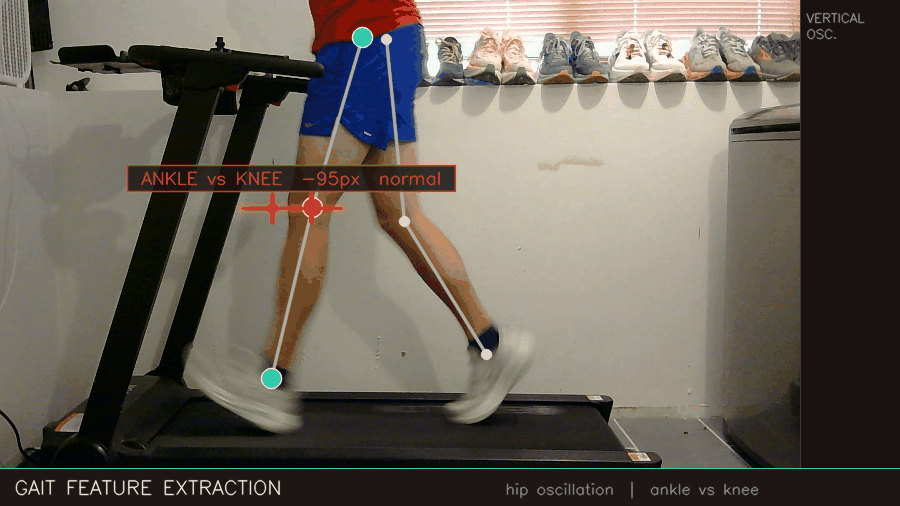
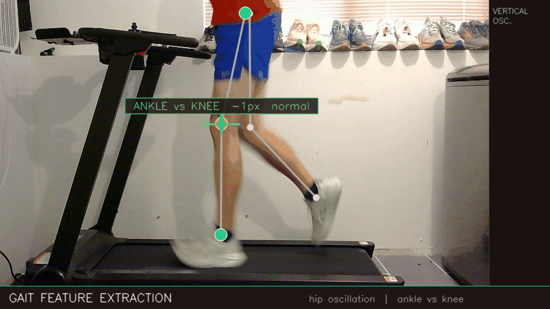
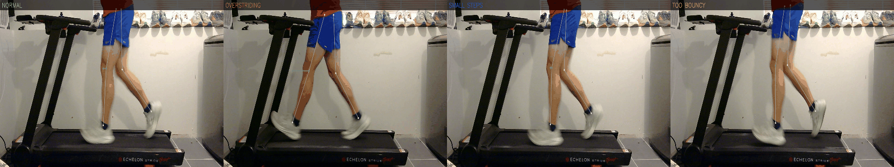
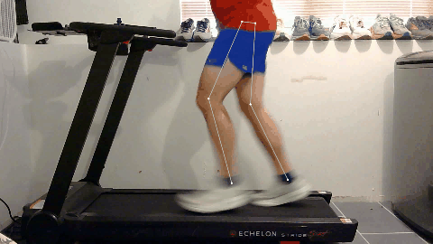

# Running Gait Analysis

Classifying running style from video using pose estimation and machine learning — built end-to-end from data collection through a trained Random Forest classifier.


> *Four running styles annotated in real-time: hip vertical oscillation (teal trail + right panel) and ankle-vs-knee position at foot strike. Classifier predicts style per stride.*

---

## What it does

Given a 30-second treadmill video, the pipeline:

1. **Extracts pose keypoints** per frame using YOLOv8x on Apple Silicon MPS
2. **Detects stride phases** (contact / air) from ankle X-velocity oscillation
3. **Engineers biomechanical features** per stride: cadence, contact ratio, hip oscillation, knee angle, ankle-vs-knee position at foot strike
4. **Classifies style** with a Random Forest trained on labeled runs

The four styles it distinguishes:

| Style | Key signal |
|---|---|
| **Normal** | Ankle lands near or behind knee; moderate hip oscillation |
| **Overstriding** | Ankle clearly ahead of knee at foot strike — heel reaches forward |
| **Small steps** | Higher cadence, shorter stride time, less air time |
| **Too bouncy** | Exaggerated vertical hip oscillation, larger flight arc |

---

## Results

77% overall accuracy (4-class, chance = 25%) with leave-one-run-out cross-validation on 8 labeled runs.

| Style | Precision | Recall | F1 |
|---|---|---|---|
| Normal | 0.66 | 0.79 | 0.72 |
| Overstriding | 0.70 | 0.64 | 0.67 |
| Small steps | 0.81 | 0.64 | 0.72 |
| Too bouncy | 0.88 | 0.87 | 0.87 |

---

## Feature extraction

The pipeline extracts 11 biomechanical features per stride. The two most interpretable:

**Hip vertical oscillation** — the vertical range of the hip over one stride cycle, measured from tilt-corrected keypoints. Shown as the teal waveform in the right panel.

**Ankle vs knee at foot strike** — horizontal distance between ankle and knee at initial contact. Positive = ankle forward of knee (overstriding). The measurement is captured at the frame just before the ankle X-velocity sign change, which corresponds to actual foot strike.



> *Normal run: teal hip trail shows the bounce arc; the measurement line stays green as the ankle consistently lands behind the knee.*



> *Overstriding: measurement line turns red as the ankle lands ahead of the knee.*



> *Too Bouncy: vertical oscillation turns red to indicate a larger than normal vertical hip oscillation*
---

## Style comparison at foot strike



---

## Live classification



Evaluating on a held-out test video (all four styles performed in sequence):

```bash
uv run python evaluate_video.py runs/20260609_181605
```

The output overlays the per-stride prediction with a probability bar for each class, updated at every detected foot strike.

---

## Data

8 labeled treadmill runs recorded June 9, 2026 with an iPhone via Continuity Camera at 30fps 1080p. Two repeats of each style, same shoe, same speed, perpendicular camera angle.

```
runs/
  20260609_180856/   normal        repeat 1
  20260609_181012/   overstriding  repeat 1
  20260609_181058/   small_steps   repeat 1
  20260609_181151/   too_bouncy    repeat 1
  20260609_181245/   normal        repeat 2
  20260609_181332/   overstriding  repeat 2
  20260609_181419/   small_steps   repeat 2
  20260609_181509/   too_bouncy    repeat 2
  20260609_181605/   test video    (all styles in sequence, not used for training)
```

Each run folder contains `pose_yolo.csv` — one row per video frame with 17 COCO keypoints (x, y, confidence).

---

## How to run

```bash
# Install dependencies
uv sync

# Record a new run (iPhone via Continuity Camera recommended)
uv run python app.py

# Run YOLO pose estimation on recorded videos
uv run python batch_process.py

# Extract per-stride features and update style_stride_features.csv
uv run python style_features.py

# Train and evaluate in the notebook
jupyter lab style_model.ipynb

# Run classifier on a video, produce annotated output
uv run python evaluate_video.py runs/FOLDER_NAME

# Regenerate portfolio visualizations
uv run python visualize_features.py
```

---

## Project structure

```
app.py                     Video recorder — no YOLO during capture, pure high-fps recording
batch_process.py           Batch YOLO pose extraction across all run folders
yolo_process.py            Per-video YOLO inference → pose_yolo.csv
analyze_runs.py            Core stride phase detection and biomechanical utilities
style_features.py          Per-stride feature extraction, run labels, STYLE_RUNS registry
style_model.ipynb          EDA, Random Forest training, leave-one-run-out CV, confusion matrix
evaluate_video.py          Runs trained model on a video and produces annotated output
visualize_features.py      Generates portfolio visualizations (all_styles.mp4 etc.)

style_stride_features.csv  Extracted features — 294 strides × 18 columns
style_model.pkl            Trained Random Forest + feature list + class labels
output/                    Generated visualizations
runs/                      Run data (pose CSVs committed; raw videos gitignored)
```

---

## Dependencies

- [Ultralytics YOLOv8](https://github.com/ultralytics/ultralytics) — pose estimation (MPS-accelerated on Apple Silicon)
- scikit-learn — Random Forest classifier
- OpenCV — video I/O and annotation
- scipy, pandas, numpy — signal processing and feature engineering
- imageio — GIF export

YOLO weights (`yolov8x-pose.pt`) are not tracked in git. They download automatically on first use, or manually:

```bash
uv run python -c "from ultralytics import YOLO; YOLO('yolov8x-pose.pt')"
```
